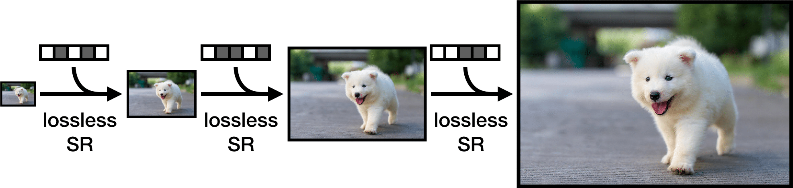

# Lossless Image Compression through Super-Resolution  <br>
[Sheng Cao](https://caoscott.github.io/),
[Chao-Yuan Wu](https://www.cs.utexas.edu/~cywu/), 
[Philipp Kr&auml;henb&uuml;hl](http://www.philkr.net/).  
## [[Paper]](https://arxiv.org/abs/2004.02872) ## 

<div align="center">
  
</div>

## Citation
```bibtex
@article{cao2020lossless,
  title={Lossless Image Compression through Super-Resolution},
  author={Cao, Sheng and Wu, Chao-Yuan and and Kr{\"a}henb{\"u}hl, Philipp},
  year={2020},
  journal={arXiv preprint arXiv:2004.02872},
}
```

If you use our codebase, please consider also [citing L3C](https://github.com/fab-jul/L3C-PyTorch#citation)

## Overview
This is the official implementation of SReC in [PyTorch](http://pytorch.org/). 
SReC frames lossless compression as a super-resolution problem and applies neural networks to compress images. 
SReC can achieve state-of-the-art compression rates on large datasets with practical runtimes. 
Training, compression, and decompression are fully supported and open-sourced.

## Getting Started
We recommend the following steps for getting started.

1. [Install the necessary dependencies](INSTALL.md)
2. [Download the Open Images validation set](http://data.vision.ee.ethz.ch/mentzerf/validation_sets_lossless/val_oi_500_r.tar.gz)
3. [Run compression on Open Images validation set](#compressiondecompression) with [trained model weights](#model-weights)

## Installation
See [here](INSTALL.md) for installation instructions.

## Model Weights
We've released trained models for both [ImageNet64](https://arxiv.org/abs/1707.08819) and [Open Images (PNG)](https://storage.googleapis.com/openimages/web/index.html). 
All compression results are measured in bits per subpixel (bpsp).

| Dataset | Bpsp | Model Weights |
| ----------- | ---- | ---------------------- |
| ImageNet64 | 4.29 | [models/imagenet64.pth](models/imagenet64.pth) |
| Open Images | 2.70 | [models/openimages.pth](models/openimages.pth) |

## Training
To run code, you need to be in top level directory.
```
python3 -um src.train \
  --train-path "path to directory of training images" \
  --train-file "list of filenames of training images, one filename per line" \
  --eval-path "path to directory of eval images" \
  --eval-file "list of filenames of eval images, one filename per line" \
  --plot "directory to store model output" \
  --batch "batch size"
```

The training images must be organized in form of `train-path/filename` from filename in train-file. Same thing applies to eval images.

We've included our training and eval files used for ImageNet64 and Open Images (PNG) in `datasets` directory. 

For ImageNet64, we use a slightly different set of hyperparameters than Open Images hyperparameters, which are the default. To train ImageNet64 based on settings from our paper, run 
```
python3 -um src.train \
  --train-path "path to directory of training images" \
  --train-file "list of filenames of training images, one filename per line" \
  --eval-path "path to directory of eval images" \
  --eval-file "list of filenames of eval images, one filename per line" \
  --plot "directory to store model output" \
  --batch "batch size" \
  --epochs 10 \
  --lr-epochs 1 \
  --crop 64
```

Run `python3 -um src.train --help` for a list of tunable hyperparameters.

## Evaluation
Given a model checkpoint, this evaluates theoretical bits/subpixel (bpsp) based on log-likelihood. The log-likelihood bpsp lower-bounds the actual compression bpsp.
```
python3 -um src.eval \
  --path "path to directory of images" \
  --file "list of filenames of images, one filename per line" \
  --load "path to model weights"
```

## Compression/Decompression

With torchac installed, you can run compression/decompression to convert any image into .srec files.
The following compresses a directory of images.
```
python3 -um src.encode \
  --path "path to directory of images" \ 
  --file "list of filenames of images, one filename per line" \
  --save-path "directory to save new .srec files" \
  --load "path to model weights"
```
If you want an accurate runtime, we recommend running python with `-O` flag to disable asserts.
We also include an optional `--decode` flag so that you can check if decompressing the .srec file gives the original image, as well as provide runtime for decoding.

To convert .srec files into PNG, you can run
```
python3 -um src.decode \
  --path "path to directory of .srec images" \ 
  --file "list of filenames of .srec images, one filename per line" \
  --save-path "directory to save png files" \
  --load "path to model weights"
```

## Downloading ImageNet64
You can download ImageNet64 training and validation sets [here](http://www.image-net.org/small/download.php).

## Preparing Open Images Dataset (PNG)
We use the same set of training and validation images of Open Images as [L3C](https://github.com/fab-jul/L3C-PyTorch). 

For **validation images**, you can [**download them here**](http://data.vision.ee.ethz.ch/mentzerf/validation_sets_lossless/val_oi_500_r.tar.gz).

For **training images**, please clone the [L3C repo](https://github.com/fab-jul/L3C-PyTorch/) and run [script from here](https://github.com/fab-jul/L3C-PyTorch#prepare-open-images-for-training)

See [this issue](https://github.com/fab-jul/L3C-PyTorch/issues/14) for differences between Open Images JPEG and Open Images PNG.

## Acknowledgment
Thanks to [L3C](https://github.com/fab-jul/L3C-PyTorch) for implementations of EDSR, logistic mixtures, and arithmetic coding.
Special thanks to [Fabian Mentzer](https://github.com/fab-jul) for letting us know about issues with the preprocessing script for Open Images JPEG and resolving them quickly.
